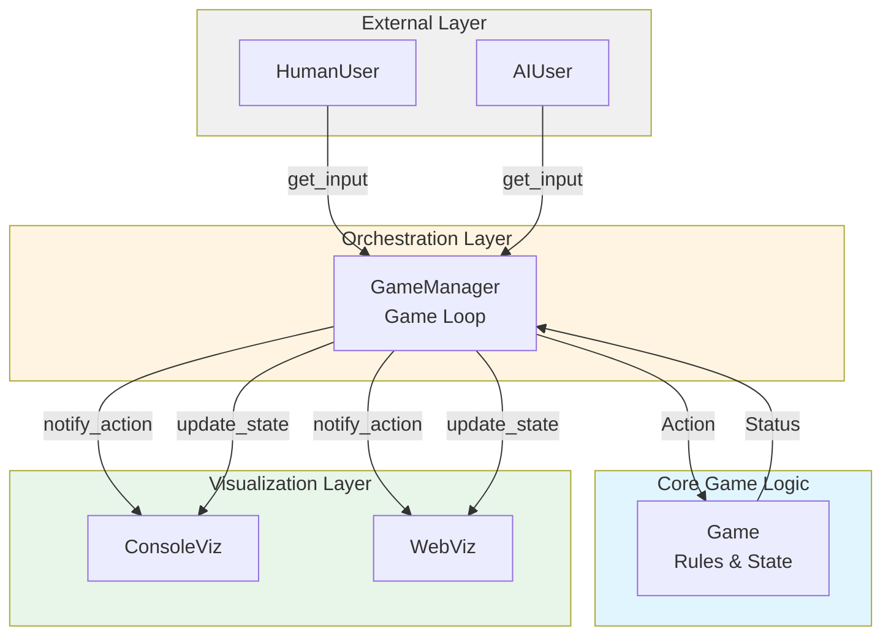

# PyCatan — Blog Post 1: Architecture & Design Decisions

*Note: This post is available in both Hebrew and English. English version follows the Hebrew section.*

---

## 🇮🇱 עברית

### רקע ומטרות הפרויקט

פרויקט הגמר שלי מתמקד בבניית שכבת סימולציה מלאה מעל ספריית `pycatan` הקיימת. הספרייה המקורית מספקת מימוש בסיסי של חוקי המשחק Settlers of Catan, אך חסרה לה תשתית לניהול משחק מלא, תמיכה בסוגי שחקנים שונים, וממשקי תצוגה.

**המטרה המרכזית:** לבנות פלטפורמה מודולרית שתאפשר:
- ניהול משחק אוטומטי עם כללי תורות מלאים
- תמיכה בשחקנים אנושיים ו-AI באותה מערכת
- ויזואליזציה בזמן אמת (Console + Web)
- בסיס להרחבה עתידית של תקשורת בין-סוכנים (Multi-Agent Systems)

### החלטות אדריכליות

בשלב התכנון הראשוני זיהיתי שהבעיה המרכזית היא **הפרדת אחריות** (Separation of Concerns). המשחק הקיים מכיל את הלוגיקה, אך לא יודע דבר על זרימת תורות, שחקנים, או תצוגה. לכן בניתי את המערכת בשכבות:

#### 1. Game Layer (Core Logic)
השכבה הקיימת. מכילה את כל חוקי המשחק: בניה, מסחר, קלפי פיתוח, תנאי ניצחון.
- **אחריות:** Validation של פעולות, ביצוע שינויים במצב המשחק
- **לא אחראית על:** זרימת תורות, בחירת פעולות, תצוגה

#### 2. GameManager (Orchestration Layer)
השכבה שפיתחתי לניהול זרימת המשחק.
- **אחריות:** Game loop, ניהול תורות, תיאום בין Users ל-Game
- **תפקיד מרכזי:** מתעד את רצף הפעולות ומבטיח ביצוע חוקי

#### 3. User Abstraction
ממשק אחיד לקבלת החלטות מכל סוג שחקן.
- `User` (abstract) → ממשק בסיסי
- `HumanUser` → parser לפקודות CLI
- `AIUser` → decision-making אלגוריתמי

העיקרון: GameManager לא צריך לדעת **מי** מקבל את ההחלטה, רק **מה** ההחלטה.

#### 4. Visualization Layer
תצוגה מנותקת מהלוגיקה.
- `ConsoleVisualization` → output צבעוני לטרמינל
- `WebVisualization` → Flask + SSE לעדכונים בזמן אמת

**עיקרון מנחה:**
```
Game     = What is allowed (rules)
Manager  = When and how (flow)
User     = What to do (decisions)
Visualization = How to present (display)
```

### Actions Model: Protocol Between Components

בעיה שזיהיתי מוקדם: איך Users מתקשרים עם Game בצורה אחידה?

**הפתרון:** מודל `Action` סטנדרטי.

כל פעולה במשחק מיוצגת כאובייקט:
```python
@dataclass
class Action:
    type: ActionType
    args: Dict[str, Any]
```

**יתרונות הגישה:**
1. **Validation מרכזית** - GameManager יכול לבדוק תקינות לפני ביצוע
2. **Serialization** - קל לשמור/לשדר פעולות (חשוב ל-AI agents)
3. **Visualization** - התראות אחידות לכל הממשקים
4. **AI Planning** - AI יכול לייצר רשימת Actions ולבחור אופטימלית

**דוגמה מהקוד:**


```python
from pycatan.actions import Action, ActionType

# User מחזיר Action object
action = Action(
    type=ActionType.ADD_SETTLEMENT,
    args={
        'player': 0,
        'point': board.points[0][0],
        'is_starting': True
    }
)

# GameManager validates and executes
status = game.add_settlement(**action.args)
if status == Statuses.OK:
    visualization.notify_action(action, status)
```

### User Abstraction: Polymorphic Decision Making

החלטה מרכזית: כל סוג שחקן ממ מש את אותו ממשק.

```python
class User(ABC):
    @abstractmethod
    def get_input(self, game_state: GameState) -> Optional[Action]:
        """Return next action based on current game state."""
        pass
```

**מימושים נוכחיים:**

1. **HumanUser** - Parser לפקודות טקסט:
   - `build settlement 0 0` → `Action(ADD_SETTLEMENT, {...})`
   - תמיכה ב-15+ סוגי פקודות
   - Error handling ו-suggestions

2. **AIUser** - Decision algorithm (בפיתוח):
   - מקבל `GameState`
   - מעריך אפשרויות
   - מחזיר `Action` אופטימלי

**תוכניות עתידיות:**
Multi-Agent Communication Layer - AI agents יוכלו לנהל משא ומתן:
```python
# Future concept
ai1.propose_trade(ai2, offer={Wood: 2}, request={Brick: 1})
ai2.evaluate_and_respond()  # Returns acceptance/counter-offer
```

### Architecture Diagram



### Current Status & Next Steps

**הושלם עד כה (נכון ל-06/12/2025):**
- ✅ Actions model + 15 action types
- ✅ User abstraction (Human + AI base)
- ✅ GameManager core loop
- ✅ ConsoleVisualization (color-coded, real-time)
- ✅ WebVisualization (Flask + SSE)
- ✅ 75 unit tests

**בעבודה:**
- 🔄 Turn rules (dice, robber, discard on 7)
- 🔄 Integration testing (end-to-end game simulation)

**פוסטים עתידיים:**
1. מימוש חוקי תורות - האתגרים בניהול ה-Robber ו-discard
2. Trade system - משא ומתן בין שחקנים (approval flow)
3. Web visualization deep-dive - SSE, board rendering, real-time sync
4. AI player implementation - decision trees ואסטרטגיה

---

## 🇺🇸 English Version

### Project Background & Objectives

This capstone project focuses on building a complete simulation layer on top of the existing `pycatan` library. The original library provides basic Settlers of Catan game logic implementation, but lacks infrastructure for full game management, support for different player types, and display interfaces.

**Core Objective:** Build a modular platform that enables:
- Automatic game management with complete turn rules
- Support for both human and AI players in the same system
- Real-time visualization (Console + Web)
- Foundation for future multi-agent communication systems

### Architectural Decisions

During initial planning, I identified that the core challenge was **Separation of Concerns**. The existing game contains the logic but knows nothing about turn flow, players, or display. Therefore, I built the system in layers:

#### 1. Game Layer (Core Logic)
The existing layer. Contains all game rules: building, trading, development cards, victory conditions.
- **Responsible for:** Action validation, game state mutations
- **Not responsible for:** Turn flow, action selection, display

#### 2. GameManager (Orchestration Layer)
The layer I developed for game flow management.
- **Responsible for:** Game loop, turn management, coordinating Users with Game
- **Core role:** Documents action sequence and ensures legal execution

#### 3. User Abstraction
Uniform interface for receiving decisions from any player type.
- `User` (abstract) → base interface
- `HumanUser` → CLI command parser
- `AIUser` → algorithmic decision-making

Principle: GameManager doesn't need to know **who** makes the decision, only **what** the decision is.

#### 4. Visualization Layer
Display decoupled from logic.
- `ConsoleVisualization` → colored terminal output
- `WebVisualization` → Flask + SSE for real-time updates

**Guiding Principle:**
```
Game     = What is allowed (rules)
Manager  = When and how (flow)
User     = What to do (decisions)
Visualization = How to present (display)
```

### Actions Model: Inter-Component Protocol

Early problem identified: How do Users communicate with Game uniformly?

**Solution:** Standardized `Action` model.

Every game action is represented as an object:
```python
@dataclass
class Action:
    type: ActionType
    args: Dict[str, Any]
```

**Approach Benefits:**
1. **Centralized validation** - GameManager can check validity before execution
2. **Serialization** - Easy to store/transmit actions (important for AI agents)
3. **Visualization** - Uniform notifications for all interfaces
4. **AI Planning** - AI can generate action lists and choose optimally

**Code Example:**

```python
from pycatan.actions import Action, ActionType

# User returns Action object
action = Action(
    type=ActionType.ADD_SETTLEMENT,
    args={
        'player': 0,
        'point': board.points[0][0],
        'is_starting': True
    }
)

# GameManager validates and executes
status = game.add_settlement(**action.args)
if status == Statuses.OK:
    visualization.notify_action(action, status)
```

### User Abstraction: Polymorphic Decision Making

Central decision: All player types implement the same interface.

```python
class User(ABC):
    @abstractmethod
    def get_input(self, game_state: GameState) -> Optional[Action]:
        """Return next action based on current game state."""
        pass
```

**Current Implementations:**

1. **HumanUser** - Text command parser:
   - `build settlement 0 0` → `Action(ADD_SETTLEMENT, {...})`
   - Supports 15+ command types
   - Error handling and suggestions

2. **AIUser** - Decision algorithm (in development):
   - Receives `GameState`
   - Evaluates options
   - Returns optimal `Action`

**Future Plans:**
Multi-Agent Communication Layer - AI agents can negotiate:
```python
# Future concept
ai1.propose_trade(ai2, offer={Wood: 2}, request={Brick: 1})
ai2.evaluate_and_respond()  # Returns acceptance/counter-offer
```

### Architecture Diagram

(Same diagram as Hebrew section - visual language is universal)

### Current Status & Next Steps

**Completed so far (as of 06/12/2025):**
- ✅ Actions model + 15 action types
- ✅ User abstraction (Human + AI base)
- ✅ GameManager core loop
- ✅ ConsoleVisualization (color-coded, real-time)
- ✅ WebVisualization (Flask + SSE)
- ✅ 75 unit tests

**In Progress:**
- 🔄 Turn rules (dice, robber, discard on 7)
- 🔄 Integration testing (end-to-end game simulation)

**Future Posts:**
1. Turn rules implementation - Robber & discard management challenges
2. Trade system - Inter-player negotiation (approval flow)
3. Web visualization deep-dive - SSE, board rendering, real-time sync
4. AI player implementation - Decision trees and strategy
